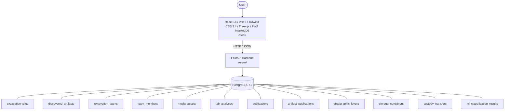

# Architecture

_Auto-generated by the SDLC Assistant from the generated codebase and the approved Feature Spec (latest: SCRUM-211). Regenerated on each push._

## System Diagram

## Tech Stack
- **language**: Python 3.11
- **backend_framework**: FastAPI 0.109+
- **orm**: SQLAlchemy 2.0+
- **database**: PostgreSQL 15
- **frontend**: React 18 / Vite 5 / Tailwind CSS 3.4 / Three.js / PWA IndexedDB
- **cloud_provider**: GCP (Cloud Run, Cloud SQL PostgreSQL, Google Cloud Storage)
- **constitution_section_4_followed**: True

## Backend Modules (server/)
- server/__init__.py
- server/api/__init__.py
- server/api/v1/__init__.py
- server/api/v1/endpoints/__init__.py
- server/api/v1/endpoints/artifacts.py
- server/api/v1/endpoints/custody.py
- server/api/v1/endpoints/dashboard.py
- server/api/v1/endpoints/lab.py
- server/api/v1/endpoints/media.py
- server/api/v1/endpoints/ml.py
- server/api/v1/endpoints/publications.py
- server/api/v1/endpoints/qr.py
- server/api/v1/endpoints/sites.py
- server/api/v1/endpoints/stratigraphy.py
- server/api/v1/endpoints/sync.py
- server/api/v1/endpoints/teams.py
- server/database.py
- server/main.py
- server/models/__init__.py
- server/models/artifact.py
- server/models/custody.py
- server/models/lab.py
- server/models/media.py
- server/models/ml.py
- server/models/publication.py
- server/models/site.py
- server/models/stratigraphy.py
- server/models/sync.py
- server/models/team.py
- server/schemas/__init__.py
- server/schemas/artifact.py
- server/schemas/custody.py
- server/schemas/dashboard.py
- server/schemas/lab.py
- server/schemas/media.py
- server/schemas/ml.py
- server/schemas/publication.py
- server/schemas/site.py
- server/schemas/stratigraphy.py
- server/schemas/team.py

## Frontend Modules (client/)
- client/eslint.config.js
- client/postcss.config.js
- client/src/App.jsx
- client/src/App.test.jsx
- client/src/components/artifacts/ArtifactForm.jsx
- client/src/components/artifacts/ArtifactTable.jsx
- client/src/components/lab/LabRequestForm.jsx
- client/src/components/lab/LabWorkflowTable.jsx
- client/src/components/layout/Navbar.jsx
- client/src/components/media/PhotoUploader.jsx
- client/src/components/publications/PublicationForm.jsx
- client/src/components/publications/PublicationTable.jsx
- client/src/components/sites/SiteForm.jsx
- client/src/components/sites/SiteTable.jsx
- client/src/components/teams/TeamForm.jsx
- client/src/components/teams/TeamTable.jsx
- client/src/main.jsx
- client/src/pages/ArtifactsPage.jsx
- client/src/pages/DashboardPage.jsx
- client/src/pages/LabAnalysisPage.jsx
- client/src/pages/PublicationsPage.jsx
- client/src/pages/SitesPage.jsx
- client/src/pages/TeamsPage.jsx
- client/src/services/api.js
- client/src/services/api.test.js
- client/src/setup.js
- client/tailwind.config.js
- client/vite.config.js

## API Endpoints
- GET /api/v1/sites/{site_id}/stratigraphy
- POST /api/v1/sites/{site_id}/stratigraphy
- POST /api/v1/sync/batch
- GET /api/v1/sync/status
- POST /api/v1/custody/storage-containers
- POST /api/v1/custody/transfer
- GET /api/v1/custody/history/{artifact_id}
- GET /api/v1/qr/generate/{entity_type}/{id}
- POST /api/v1/ml/classify-material

## Data Model
- excavation_sites
- discovered_artifacts
- excavation_teams
- team_members
- media_assets
- lab_analyses
- publications
- artifact_publications
- stratigraphic_layers
- storage_containers
- custody_transfers
- ml_classification_results
- sync_transactions
