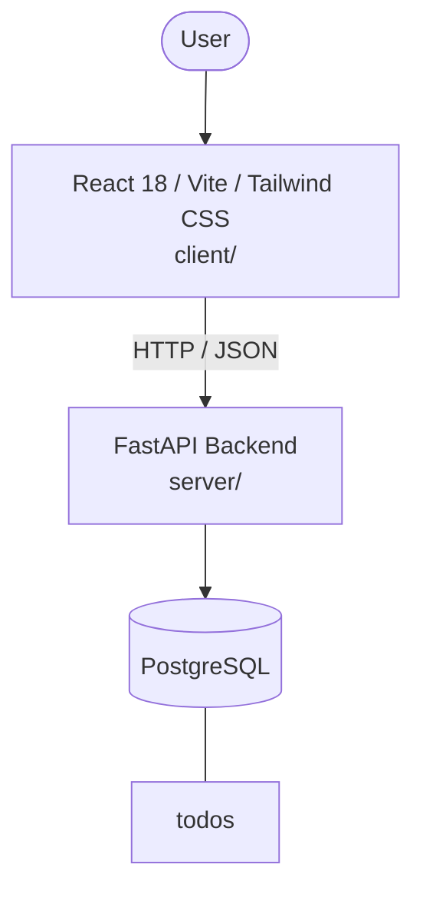

# Architecture

_Auto-generated by the SDLC Assistant from the generated codebase and the approved Feature Spec (latest: SCRUM-167). Regenerated on each push._

## System Diagram

## Tech Stack
- **language**: Python 3.11
- **backend_framework**: FastAPI
- **orm**: SQLAlchemy 2.x
- **database**: PostgreSQL
- **frontend**: React 18 / Vite / Tailwind CSS
- **cloud_provider**: GCP (Cloud Run)
- **constitution_section_4_followed**: True

## Backend Modules (server/)
- server/__init__.py
- server/api/__init__.py
- server/api/v1/__init__.py
- server/api/v1/todos.py
- server/database.py
- server/main.py
- server/models/__init__.py
- server/models/todo.py
- server/schemas/__init__.py
- server/schemas/todo.py
- server/tests/__init__.py
- server/tests/conftest.py
- server/tests/test_todos.py

## Frontend Modules (client/)
- client/eslint.config.js
- client/postcss.config.js
- client/src/App.jsx
- client/src/App.test.jsx
- client/src/components/Navbar.jsx
- client/src/components/StatCard.jsx
- client/src/components/TaskToolbar.jsx
- client/src/components/TodoModal.jsx
- client/src/components/TodoTable.jsx
- client/src/main.jsx
- client/src/pages/DashboardPage.jsx
- client/src/services/api.js
- client/src/setup.js
- client/tailwind.config.js
- client/vite.config.js

## API Endpoints
- GET /api/v1/todos
- POST /api/v1/todos
- GET /api/v1/todos/{todo_id}
- PUT /api/v1/todos/{todo_id}
- DELETE /api/v1/todos/{todo_id}

## Data Model
- todos
