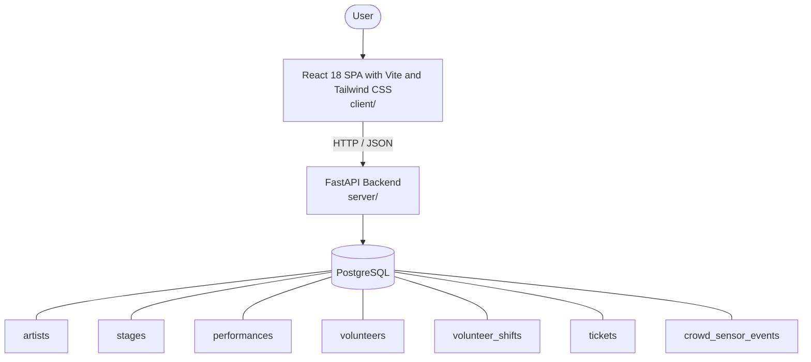

# Architecture

_Auto-generated by the SDLC Assistant from the generated codebase and the approved Feature Spec (latest: SCRUM-64). Regenerated on each push._

## System Diagram

## Tech Stack
- **language**: Python 3.11
- **backend_framework**: FastAPI
- **orm**: SQLAlchemy 2.x
- **database**: PostgreSQL
- **frontend**: React 18 SPA with Vite and Tailwind CSS
- **cloud_provider**: GCP (Cloud Run, Cloud SQL, Artifact Registry)
- **constitution_section_4_followed**: True

## Backend Modules (server/)
- server/__init__.py
- server/conftest.py
- server/crud.py
- server/database.py
- server/main.py
- server/models.py
- server/routers/__init__.py
- server/routers/analytics.py
- server/routers/artists.py
- server/routers/stages.py
- server/routers/tickets.py
- server/routers/volunteers.py
- server/schemas.py
- server/security.py
- server/tests/__init__.py
- server/tests/test_analytics.py
- server/tests/test_stages.py
- server/tests/test_tickets.py
- server/tests/test_volunteers.py

## Frontend Modules (client/)
- (no client/ files found yet)

## API Endpoints
- GET /api/v1/stages
- POST /api/v1/stages/{id}/performances
- POST /api/v1/tickets/validate
- POST /api/v1/tickets/sync
- GET /api/v1/volunteers/shifts
- POST /api/v1/volunteers/shifts/{id}/check-in
- POST /api/v1/volunteers/shifts/{id}/drop
- POST /api/v1/analytics/crowd/telemetry
- GET /api/v1/analytics/crowd

## Data Model
- artists
- stages
- performances
- volunteers
- volunteer_shifts
- tickets
- crowd_sensor_events
