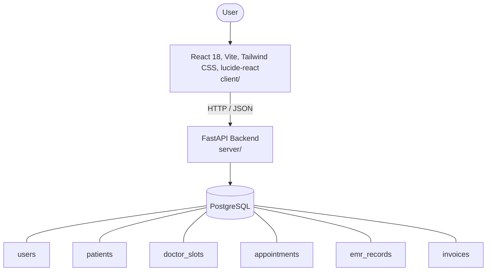

# Architecture

_Auto-generated by the SDLC Assistant from the generated codebase and the approved Feature Spec (latest: SCRUM-206). Regenerated on each push._

## System Diagram

## Tech Stack
- **language**: Python 3.11
- **backend_framework**: FastAPI
- **orm**: SQLAlchemy 2.x
- **database**: PostgreSQL
- **frontend**: React 18, Vite, Tailwind CSS, lucide-react
- **cloud_provider**: GCP (Cloud Run, Cloud SQL)
- **constitution_section_4_followed**: True

## Backend Modules (server/)
- server/__init__.py
- server/app/__init__.py
- server/app/appointments/__init__.py
- server/app/appointments/router.py
- server/app/auth/__init__.py
- server/app/auth/router.py
- server/app/auth/utils.py
- server/app/billing/__init__.py
- server/app/billing/router.py
- server/app/doctors/__init__.py
- server/app/doctors/router.py
- server/app/emr/__init__.py
- server/app/emr/router.py
- server/app/patients/__init__.py
- server/app/patients/router.py
- server/config.py
- server/database.py
- server/main.py
- server/models.py
- server/schemas.py
- server/tests/__init__.py
- server/tests/conftest.py
- server/tests/test_appointments.py
- server/tests/test_auth.py
- server/tests/test_billing.py
- server/tests/test_emr.py
- server/tests/test_patients.py

## Frontend Modules (client/)
- (no client/ files found yet)

## API Endpoints
- POST /api/v1/auth/register
- POST /api/v1/auth/login
- POST /api/v1/patients
- GET /api/v1/patients/{id}
- GET /api/v1/patients
- POST /api/v1/doctors/slots
- GET /api/v1/doctors/{id}/slots
- POST /api/v1/appointments
- PATCH /api/v1/appointments/{id}/status
- POST /api/v1/emr/records
- GET /api/v1/emr/patients/{id}
- POST /api/v1/invoices
- PATCH /api/v1/invoices/{id}/payment

## Data Model
- users
- patients
- doctor_slots
- appointments
- emr_records
- invoices
