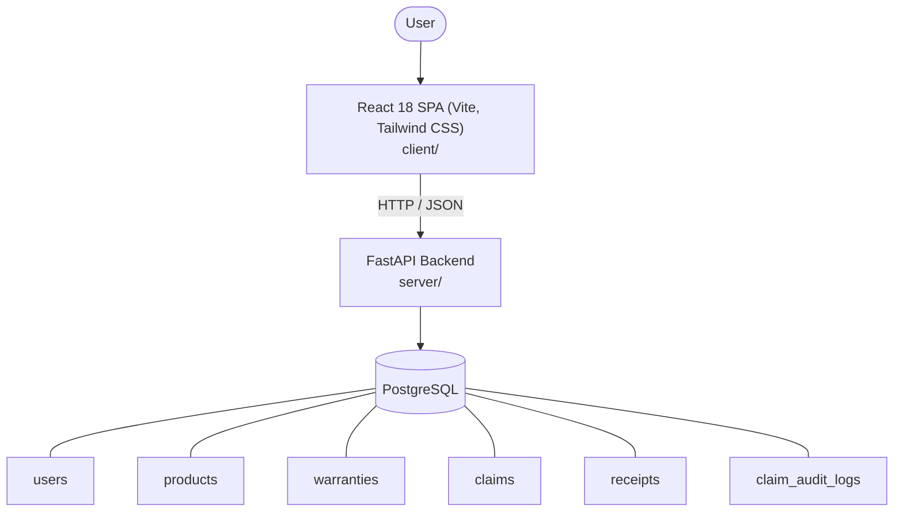

# Architecture

_Auto-generated by the SDLC Assistant from the generated codebase and the approved Feature Spec (latest: SCRUM-99). Regenerated on each push._

## System Diagram

## Tech Stack
- **language**: Python 3.11
- **backend_framework**: FastAPI
- **orm**: SQLAlchemy 2.x
- **database**: PostgreSQL
- **frontend**: React 18 SPA (Vite, Tailwind CSS)
- **cloud_provider**: Google Cloud Platform (GCP Cloud Run, Cloud SQL)
- **constitution_section_4_followed**: True

## Backend Modules (server/)
- server/__init__.py
- server/conftest.py
- server/crud.py
- server/database.py
- server/main.py
- server/models.py
- server/routers/__init__.py
- server/routers/claims.py
- server/routers/documents.py
- server/routers/products.py
- server/schemas.py
- server/services/__init__.py
- server/services/expiry.py
- server/tests/__init__.py
- server/tests/test_claims.py
- server/tests/test_documents.py
- server/tests/test_expiry.py
- server/tests/test_products.py

## Frontend Modules (client/)
- (no client/ files found yet)

## API Endpoints
- POST /api/v1/products
- GET /api/v1/products
- GET /api/v1/products/{id}
- PUT /api/v1/products/{id}
- DELETE /api/v1/products/{id}
- POST /api/v1/claims
- GET /api/v1/claims
- PATCH /api/v1/claims/{id}/status
- POST /api/v1/documents/upload

## Data Model
- users
- products
- warranties
- claims
- receipts
- claim_audit_logs
