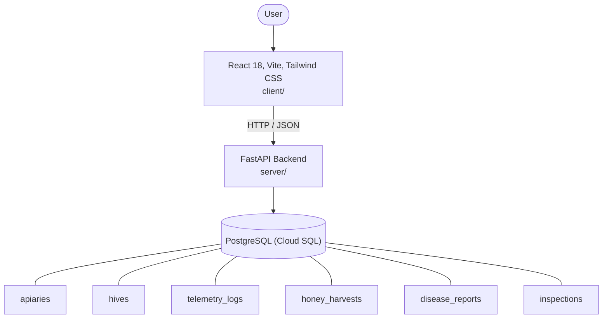

# Architecture

_Auto-generated by the SDLC Assistant from the generated codebase and the approved Feature Spec (latest: SCRUM-100). Regenerated on each push._

## System Diagram

## Tech Stack
- **language**: Python 3.11
- **backend_framework**: FastAPI
- **orm**: SQLAlchemy 2.x
- **database**: PostgreSQL (Cloud SQL)
- **frontend**: React 18, Vite, Tailwind CSS
- **cloud_provider**: Google Cloud Platform (GCP Cloud Run)
- **constitution_section_4_followed**: True

## Backend Modules (server/)
- server/__init__.py
- server/conftest.py
- server/database.py
- server/main.py
- server/models.py
- server/routers/__init__.py
- server/routers/analytics.py
- server/routers/apiaries.py
- server/routers/diseases.py
- server/routers/harvests.py
- server/routers/hives.py
- server/routers/inspections.py
- server/routers/telemetry.py
- server/schemas.py
- server/services/__init__.py
- server/services/telemetry_service.py
- server/tests/__init__.py
- server/tests/test_analytics.py
- server/tests/test_diseases.py
- server/tests/test_harvests.py
- server/tests/test_hives.py
- server/tests/test_inspections.py
- server/tests/test_main.py
- server/tests/test_telemetry.py

## Frontend Modules (client/)
- (no client/ files found yet)

## API Endpoints
- GET /api/v1/hives
- POST /api/v1/telemetry
- GET /api/v1/harvests
- POST /api/v1/harvests
- GET /api/v1/diseases/reports
- POST /api/v1/diseases/reports
- GET /api/v1/inspections
- POST /api/v1/inspections
- GET /api/v1/analytics/seasonal

## Data Model
- apiaries
- hives
- telemetry_logs
- honey_harvests
- disease_reports
- inspections
