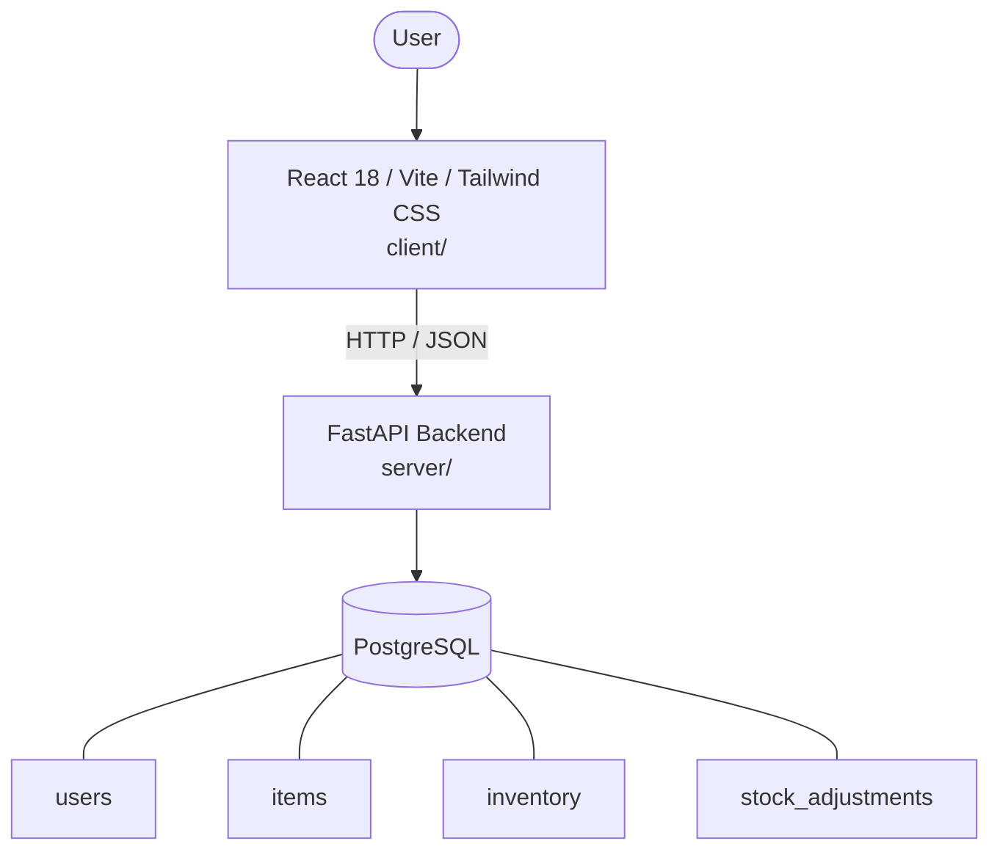

# Architecture

_Auto-generated by the SDLC Assistant from the generated codebase and the approved Feature Spec (latest: SCRUM-2). Regenerated on each push._

## System Diagram

## Tech Stack
- **language**: Python 3.11
- **backend_framework**: FastAPI
- **orm**: SQLAlchemy 2.x
- **database**: PostgreSQL
- **frontend**: React 18 / Vite / Tailwind CSS
- **cloud_provider**: Google Cloud Platform (GCP)
- **constitution_section_4_followed**: True

## Backend Modules (server/)
- server/__init__.py
- server/api/__init__.py
- server/api/v1/__init__.py
- server/api/v1/auth.py
- server/api/v1/inventory.py
- server/api/v1/items.py
- server/core/__init__.py
- server/core/config.py
- server/core/security.py
- server/database.py
- server/main.py
- server/models.py
- server/schemas.py
- server/seed.py
- server/tests/__init__.py
- server/tests/conftest.py
- server/tests/test_auth.py
- server/tests/test_inventory.py
- server/tests/test_items.py

## Frontend Modules (client/)
- (no client/ files found yet)

## API Endpoints
- GET /api/v1/items
- POST /api/v1/items
- PUT /api/v1/items/{id}
- DELETE /api/v1/items/{id}
- GET /api/v1/inventory/low-stock
- PUT /api/v1/inventory/{item_id}
- POST /api/v1/inventory/{item_id}/adjust

## Data Model
- users
- items
- inventory
- stock_adjustments
