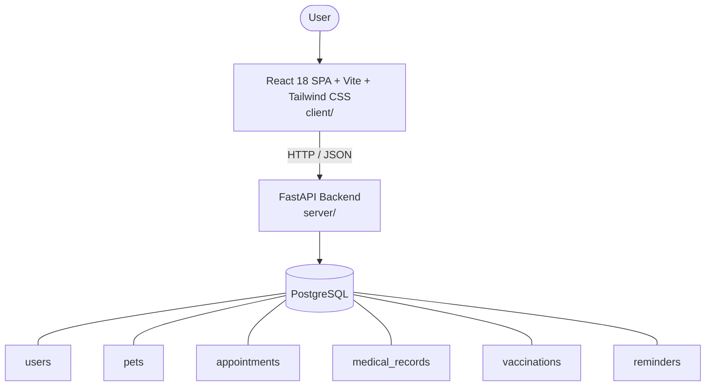

# Architecture

_Auto-generated by the SDLC Assistant from the generated codebase and the approved Feature Spec (latest: SCRUM-530). Regenerated on each push._

## System Diagram

## Tech Stack
- **language**: Python 3.11
- **backend_framework**: FastAPI
- **orm**: SQLAlchemy 2.x
- **database**: PostgreSQL
- **frontend**: React 18 SPA + Vite + Tailwind CSS
- **cloud_provider**: GCP (Cloud Run, Cloud SQL)
- **constitution_section_4_followed**: True

## Backend Modules (server/)
- server/__init__.py
- server/crud.py
- server/database.py
- server/main.py
- server/models.py
- server/routers/__init__.py
- server/routers/appointments.py
- server/routers/auth.py
- server/routers/medical_records.py
- server/routers/pets.py
- server/routers/reminders.py
- server/routers/vaccinations.py
- server/schemas.py
- server/tests/__init__.py
- server/tests/conftest.py
- server/tests/test_api.py

## Frontend Modules (client/)
- client/eslint.config.js
- client/postcss.config.js
- client/src/App.jsx
- client/src/components/Navbar.test.jsx
- client/src/components/appointments/AppointmentRoster.jsx
- client/src/components/appointments/BookingFormModal.jsx
- client/src/components/layout/Navbar.jsx
- client/src/components/medical/MedicalRecordModal.jsx
- client/src/components/medical/MedicalVisitTimeline.jsx
- client/src/components/pets/PetFormModal.jsx
- client/src/components/pets/PetProfileHero.jsx
- client/src/components/pets/PetRegistryTable.jsx
- client/src/components/vaccinations/ReminderDispatchCard.jsx
- client/src/components/vaccinations/VaccinationModal.jsx
- client/src/components/vaccinations/VaccinationTrackerTable.jsx
- client/src/context/AuthContext.jsx
- client/src/main.jsx
- client/src/pages/AppointmentsPage.jsx
- client/src/pages/AppointmentsPage.test.jsx
- client/src/pages/DashboardPage.jsx
- client/src/pages/DashboardPage.test.jsx
- client/src/pages/LoginPage.jsx
- client/src/pages/PetProfilePage.jsx
- client/src/pages/RegisterPage.jsx
- client/src/pages/VaccinationsPage.jsx
- client/src/services/api.js
- client/src/services/api.test.js
- client/src/setup.js
- client/tailwind.config.js
- client/vite.config.js

## API Endpoints
- POST /api/v1/auth/register
- POST /api/v1/auth/login
- GET /api/v1/pets
- POST /api/v1/pets
- GET /api/v1/pets/{id}
- PUT /api/v1/pets/{id}
- GET /api/v1/appointments
- POST /api/v1/appointments
- PUT /api/v1/appointments/{id}/status
- POST /api/v1/medical-records
- GET /api/v1/pets/{pet_id}/medical-records
- POST /api/v1/vaccinations
- GET /api/v1/pets/{pet_id}/vaccinations
- GET /api/v1/reminders
- POST /api/v1/reminders/process

## Data Model
- users
- pets
- appointments
- medical_records
- vaccinations
- reminders
