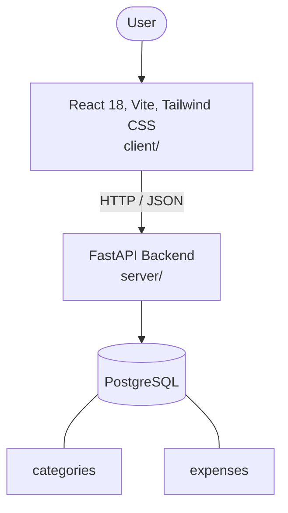

# Architecture

_Auto-generated by the SDLC Assistant from the generated codebase and the approved Feature Spec (latest: SCRUM-38). Regenerated on each push._

## System Diagram

## Tech Stack
- **language**: Python 3.11
- **backend_framework**: FastAPI
- **orm**: SQLAlchemy 2.x
- **database**: PostgreSQL
- **frontend**: React 18, Vite, Tailwind CSS
- **cloud_provider**: Google Cloud Platform (GCP)
- **constitution_section_4_followed**: True

## Backend Modules (server/)
- server/__init__.py
- server/api/__init__.py
- server/api/v1/__init__.py
- server/api/v1/categories.py
- server/api/v1/expenses.py
- server/api/v1/router.py
- server/database.py
- server/main.py
- server/models/__init__.py
- server/models/category.py
- server/models/expense.py
- server/schemas/__init__.py
- server/schemas/category.py
- server/schemas/expense.py
- server/services/__init__.py
- server/services/category_service.py
- server/services/expense_service.py
- server/tests/__init__.py
- server/tests/conftest.py
- server/tests/test_categories.py
- server/tests/test_expenses.py

## Frontend Modules (client/)
- (no client/ files found yet)

## API Endpoints
- POST /api/v1/categories
- GET /api/v1/categories
- POST /api/v1/expenses
- GET /api/v1/expenses
- GET /api/v1/expenses/{id}
- PUT /api/v1/expenses/{id}
- DELETE /api/v1/expenses/{id}
- GET /api/v1/expenses/summary

## Data Model
- categories
- expenses
