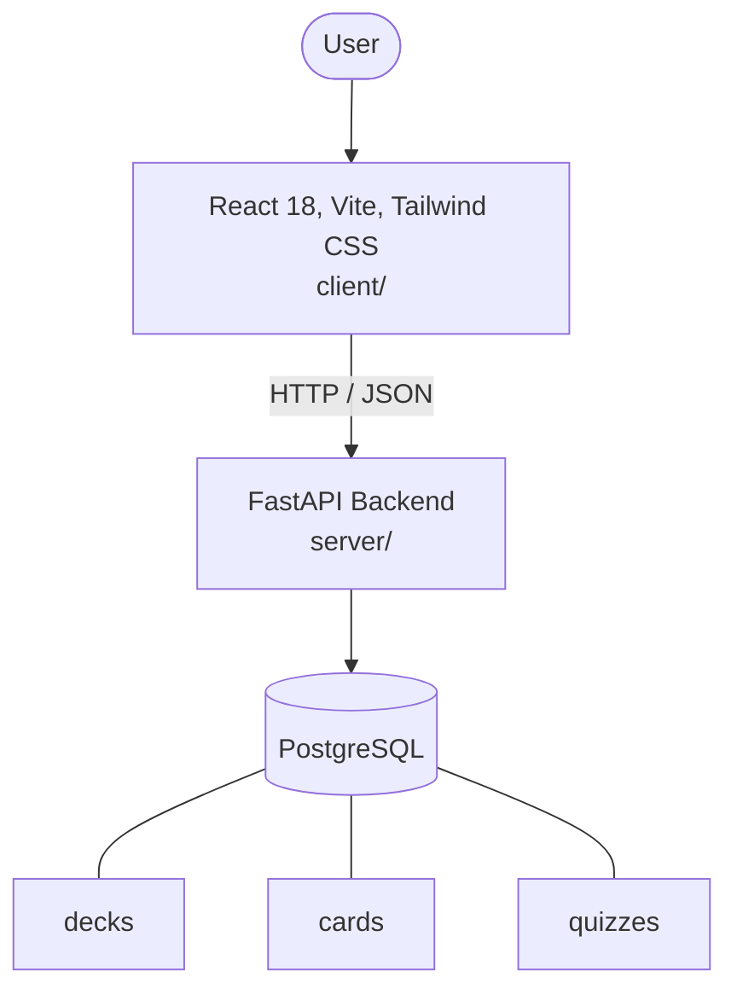

# Architecture

_Auto-generated by the SDLC Assistant from the generated codebase and the approved Feature Spec (latest: SCRUM-121). Regenerated on each push._

## System Diagram

## Tech Stack
- **language**: Python
- **backend_framework**: FastAPI
- **orm**: SQLAlchemy 2.x
- **database**: PostgreSQL
- **frontend**: React 18, Vite, Tailwind CSS
- **cloud_provider**: GCP
- **constitution_section_4_followed**: True

## Backend Modules (server/)
- server/__init__.py
- server/config.py
- server/database.py
- server/main.py
- server/models.py
- server/routers/__init__.py
- server/routers/cards.py
- server/routers/decks.py
- server/routers/quizzes.py
- server/schemas.py
- server/tests/__init__.py
- server/tests/conftest.py
- server/tests/test_cards.py
- server/tests/test_decks.py
- server/tests/test_quizzes.py

## Frontend Modules (client/)
- (no client/ files found yet)

## API Endpoints
- POST /api/v1/decks
- GET /api/v1/decks
- GET /api/v1/decks/{deck_id}
- PUT /api/v1/decks/{deck_id}
- DELETE /api/v1/decks/{deck_id}
- POST /api/v1/decks/{deck_id}/cards
- GET /api/v1/decks/{deck_id}/cards
- PUT /api/v1/cards/{card_id}
- DELETE /api/v1/cards/{card_id}
- POST /api/v1/quizzes
- POST /api/v1/quizzes/{quiz_id}/submit

## Data Model
- decks
- cards
- quizzes
