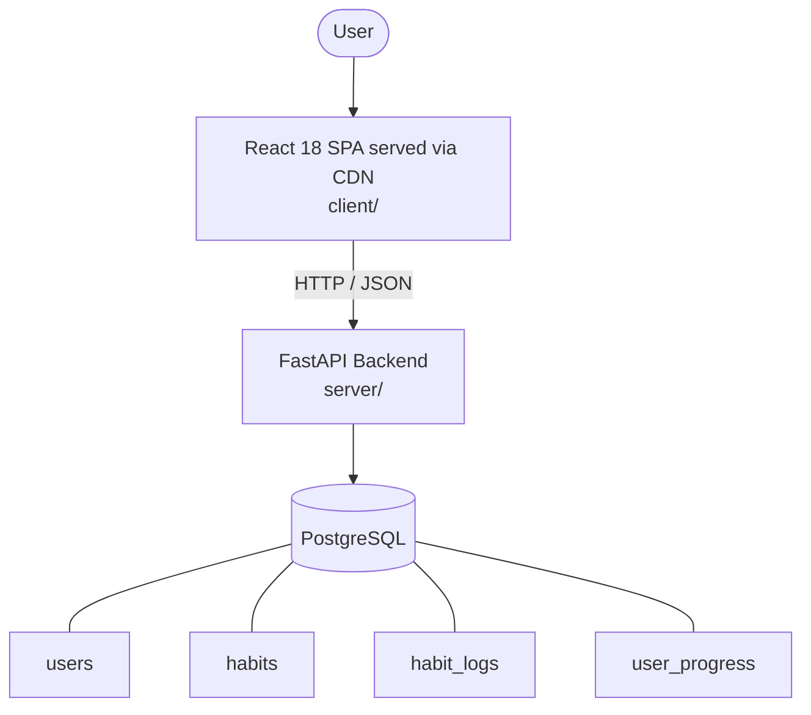

# Architecture

_Auto-generated by the SDLC Assistant from the generated codebase and the approved Feature Spec (latest: SCRUM-106). Regenerated on each push._

## System Diagram

## Tech Stack
- **language**: Python
- **backend_framework**: FastAPI
- **orm**: SQLAlchemy
- **database**: PostgreSQL
- **frontend**: React 18 SPA served via CDN
- **cloud_provider**: GCP
- **constitution_section_4_followed**: True

## Backend Modules (server/)
- server/__init__.py
- server/auth.py
- server/database.py
- server/main.py
- server/models.py
- server/routers/__init__.py
- server/routers/auth.py
- server/routers/habits.py
- server/routers/parent.py
- server/schemas.py
- server/tests/__init__.py
- server/tests/conftest.py
- server/tests/test_auth.py
- server/tests/test_habits.py
- server/tests/test_parent.py

## Frontend Modules (client/)
- (no client/ files found yet)

## API Endpoints
- POST /api/v1/auth/login
- GET /api/v1/habits
- POST /api/v1/habits/{habit_id}/complete
- GET /api/v1/parent/progress
- POST /api/v1/parent/habits/{habit_id}/toggle
- POST /api/v1/parent/progress/{child_id}/reset

## Data Model
- users
- habits
- habit_logs
- user_progress
