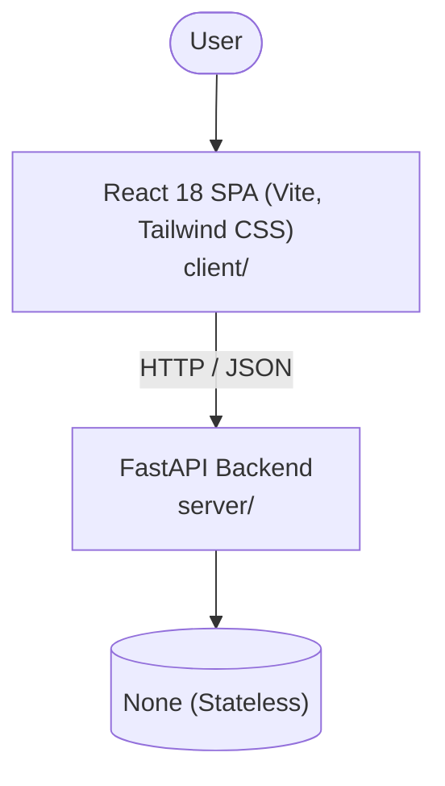

# Architecture

_Auto-generated by the SDLC Assistant from the generated codebase and the approved Feature Spec (latest: SCRUM-230). Regenerated on each push._

## System Diagram

## Tech Stack
- **language**: Python 3.11
- **backend_framework**: FastAPI
- **orm**: None (Stateless)
- **database**: None (Stateless)
- **frontend**: React 18 SPA (Vite, Tailwind CSS)
- **cloud_provider**: GCP (Cloud Run)
- **constitution_section_4_followed**: True

## Backend Modules (server/)
- server/__init__.py
- server/main.py
- server/routers/__init__.py
- server/routers/calculator.py
- server/schemas.py
- server/services/__init__.py
- server/services/calculator.py
- server/tests/__init__.py
- server/tests/conftest.py
- server/tests/test_calculator.py

## Frontend Modules (client/)
- (no client/ files found yet)

## API Endpoints
- POST /api/v1/calculate
- GET /health

## Data Model
- None
