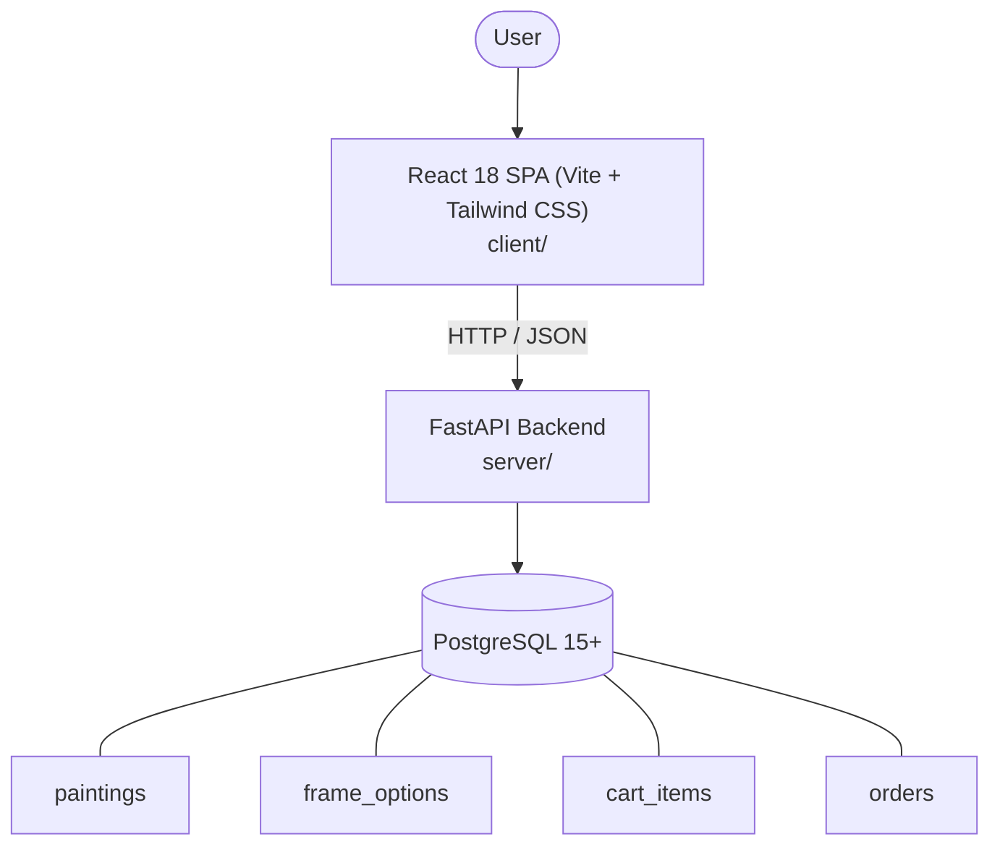

# Architecture

_Auto-generated by the SDLC Assistant from the generated codebase and the approved Feature Spec (latest: SCRUM-52). Regenerated on each push._

## System Diagram

## Tech Stack
- **language**: Python 3.11
- **backend_framework**: FastAPI
- **orm**: SQLAlchemy 2.x
- **database**: PostgreSQL 15+
- **frontend**: React 18 SPA (Vite + Tailwind CSS)
- **cloud_provider**: GCP (Cloud Run, Cloud SQL, GAR)
- **constitution_section_4_followed**: True

## Backend Modules (server/)
- server/__init__.py
- server/api/__init__.py
- server/api/v1/__init__.py
- server/api/v1/endpoints/__init__.py
- server/api/v1/endpoints/admin.py
- server/api/v1/endpoints/auth.py
- server/api/v1/endpoints/books.py
- server/api/v1/endpoints/cart.py
- server/api/v1/endpoints/checkout.py
- server/api/v1/endpoints/configurator.py
- server/api/v1/endpoints/fines.py
- server/api/v1/endpoints/inventory.py
- server/api/v1/endpoints/loans.py
- server/api/v1/endpoints/members.py
- server/api/v1/endpoints/orders.py
- server/api/v1/endpoints/paintings.py
- server/api/v1/endpoints/password_reset.py
- server/core/__init__.py
- server/core/config.py
- server/core/security.py
- server/crud.py
- server/database.py
- server/main.py
- server/models.py
- server/models_painting.py
- server/schemas.py
- server/schemas_painting.py
- server/services/__init__.py
- server/services/email.py
- server/services/pricing.py
- server/tests/conftest.py
- server/tests/test_admin.py
- server/tests/test_cart.py
- server/tests/test_checkout.py
- server/tests/test_configurator.py
- server/tests/test_inventory.py
- server/tests/test_library.py
- server/tests/test_orders.py
- server/tests/test_paintings.py
- server/tests/test_password_reset.py

## Frontend Modules (client/)
- client/eslint.config.js
- client/postcss.config.js
- client/src/App.jsx
- client/src/App.test.jsx
- client/src/components/AdminOrderTable.jsx
- client/src/components/ArtworkConfigurator.jsx
- client/src/components/CatalogGrid.jsx
- client/src/components/CheckoutForm.jsx
- client/src/components/DynamicPriceCalculator.jsx
- client/src/components/FrameSelector.jsx
- client/src/components/Header.jsx
- client/src/components/Modal.jsx
- client/src/components/Navbar.jsx
- client/src/components/OrderSummaryCard.jsx
- client/src/components/Sidebar.jsx
- client/src/components/SidebarFilter.jsx
- client/src/components/StatCard.jsx
- client/src/components/TrackingStepper.jsx
- client/src/components/catalog/AddBookModal.jsx
- client/src/components/catalog/BookCatalogTable.jsx
- client/src/components/common/Badge.jsx
- client/src/components/common/Button.jsx
- client/src/components/common/Modal.jsx
- client/src/components/common/SearchBar.jsx
- client/src/components/dashboard/ActiveLoansTable.jsx
- client/src/components/dashboard/OverdueFinesTable.jsx
- client/src/components/dashboard/QuickActionsPanel.jsx
- client/src/components/dashboard/StatCard.jsx
- client/src/components/inventory/InventoryForm.jsx
- client/src/components/inventory/InventoryTable.jsx
- client/src/components/layout/Header.jsx
- client/src/components/layout/Sidebar.jsx
- client/src/components/member/BookCard.jsx
- client/src/components/member/MyFinesPanel.jsx
- client/src/components/member/MyLoansTable.jsx
- client/src/main.jsx
- client/src/pages/AdminPage.jsx
- client/src/setup.js
- client/tailwind.config.js
- client/vite.config.js

## API Endpoints
- GET /api/v1/paintings
- GET /api/v1/paintings/{id}
- POST /api/v1/configurator/price
- GET /api/v1/cart
- POST /api/v1/cart/items
- POST /api/v1/checkout/intent
- GET /api/v1/orders/{id}
- POST /api/v1/orders/{id}/cancel
- PATCH /api/v1/admin/orders/{id}
- POST /api/v1/admin/paintings

## Data Model
- paintings
- frame_options
- cart_items
- orders
