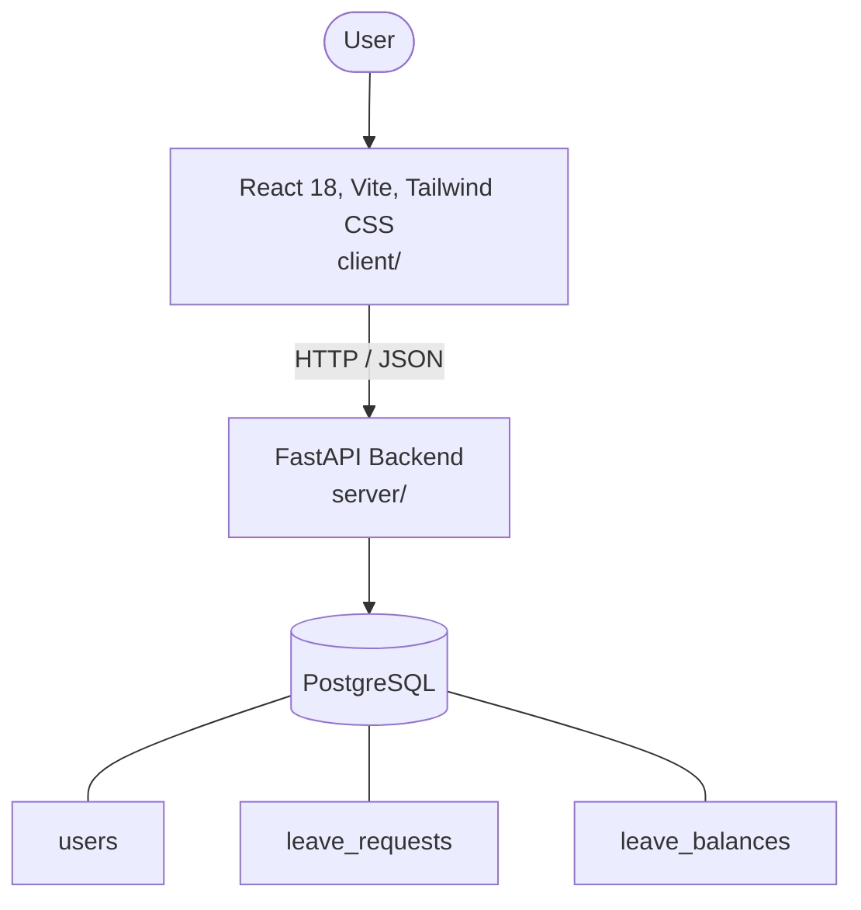

# Architecture

_Auto-generated by the SDLC Assistant from the generated codebase and the approved Feature Spec (latest: SCRUM-187). Regenerated on each push._

## System Diagram

## Tech Stack
- **language**: Python 3.11
- **backend_framework**: FastAPI
- **orm**: SQLAlchemy 2.x
- **database**: PostgreSQL
- **frontend**: React 18, Vite, Tailwind CSS
- **cloud_provider**: GCP Cloud Run
- **constitution_section_4_followed**: True

## Backend Modules (server/)
- server/__init__.py
- server/database.py
- server/main.py
- server/models/__init__.py
- server/models/leave_balance.py
- server/models/leave_request.py
- server/models/user.py
- server/routes/__init__.py
- server/routes/balances.py
- server/routes/health.py
- server/routes/leaves.py
- server/routes/users.py
- server/schemas/__init__.py
- server/schemas/leave_balance.py
- server/schemas/leave_request.py
- server/schemas/user.py
- server/services/__init__.py
- server/services/leave_service.py
- server/tests/__init__.py
- server/tests/conftest.py
- server/tests/test_balances.py
- server/tests/test_health.py
- server/tests/test_leaves.py
- server/tests/test_users.py

## Frontend Modules (client/)
- (no client/ files found yet)

## API Endpoints
- POST /api/v1/leaves
- GET /api/v1/leaves
- PATCH /api/v1/leaves/{id}/status
- GET /api/v1/balances/{user_id}

## Data Model
- users
- leave_requests
- leave_balances
