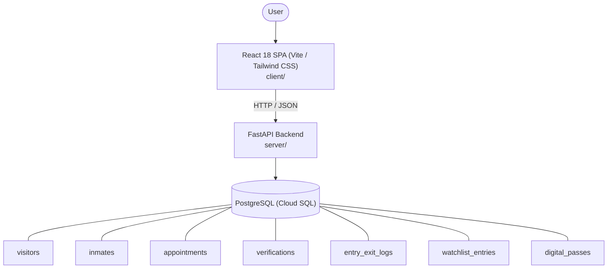

# Architecture

_Auto-generated by the SDLC Assistant from the generated codebase and the approved Feature Spec (latest: SCRUM-202). Regenerated on each push._

## System Diagram

## Tech Stack
- **language**: Python 3.11
- **backend_framework**: FastAPI
- **orm**: SQLAlchemy / Alembic
- **database**: PostgreSQL (Cloud SQL)
- **frontend**: React 18 SPA (Vite / Tailwind CSS)
- **cloud_provider**: Google Cloud Platform (Cloud Run, Cloud SQL, GCS)
- **constitution_section_4_followed**: True

## Backend Modules (server/)
- server/__init__.py
- server/auth.py
- server/conftest.py
- server/database.py
- server/main.py
- server/models.py
- server/routers/__init__.py
- server/routers/appointments.py
- server/routers/auth.py
- server/routers/entry_exit_logs.py
- server/routers/gate.py
- server/routers/inmates.py
- server/routers/verifications.py
- server/routers/visitors.py
- server/routers/watchlist.py
- server/schemas.py
- server/services/__init__.py
- server/services/appointment_service.py
- server/services/qr_service.py
- server/services/watchlist_service.py
- server/tests/__init__.py
- server/tests/test_appointments.py
- server/tests/test_auth.py
- server/tests/test_digital_pass_and_gate.py
- server/tests/test_inmates.py
- server/tests/test_qa_generated.py
- server/tests/test_visitors.py
- server/tests/test_watchlist.py

## Frontend Modules (client/)
- client/eslint.config.js
- client/postcss.config.js
- client/src/App.jsx
- client/src/components/AppointmentApprovalsTable.jsx
- client/src/components/AppointmentScheduler.jsx
- client/src/components/DigitalPassView.jsx
- client/src/components/GateControlDashboard.jsx
- client/src/components/GateControlTerminal.jsx
- client/src/components/IdentityVerificationTable.jsx
- client/src/components/VisitorHistoryTable.jsx
- client/src/components/VisitorRegistrationForm.jsx
- client/src/components/WatchlistManagementModal.jsx
- client/src/main.jsx
- client/src/pages/AdminApprovalsPage.jsx
- client/src/pages/SecurityGatePage.jsx
- client/src/pages/VisitorHistoryPage.jsx
- client/src/pages/VisitorPortalPage.jsx
- client/src/services/api.js
- client/src/setup.js
- client/src/tests/components.test.jsx
- client/tailwind.config.js
- client/vite.config.js

## API Endpoints
- POST /api/v1/visitors/register
- POST /api/v1/appointments
- PATCH /api/v1/appointments/{id}/status
- POST /api/v1/appointments/{id}/digital-pass
- POST /api/v1/gate/scan-qr
- GET /api/v1/watchlist
- POST /api/v1/watchlist
- POST /api/v1/watchlist/screen

## Data Model
- visitors
- inmates
- appointments
- verifications
- entry_exit_logs
- watchlist_entries
- digital_passes
