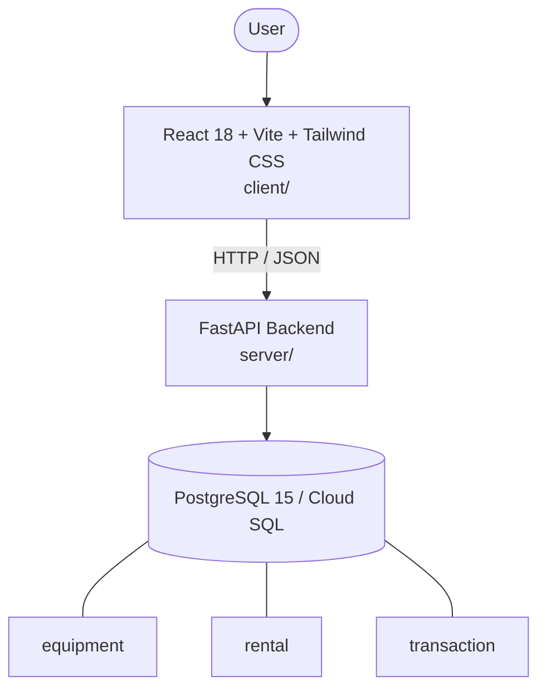

# Architecture

_Auto-generated by the SDLC Assistant from the generated codebase and the approved Feature Spec (latest: SCRUM-57). Regenerated on each push._

## System Diagram

## Tech Stack
- **language**: Python 3.11
- **backend_framework**: FastAPI
- **orm**: SQLAlchemy 2.x
- **database**: PostgreSQL 15 / Cloud SQL
- **frontend**: React 18 + Vite + Tailwind CSS
- **cloud_provider**: Google Cloud Platform (GCP Cloud Run)
- **constitution_section_4_followed**: True

## Backend Modules (server/)
- server/__init__.py
- server/auth.py
- server/conftest.py
- server/database.py
- server/main.py
- server/models.py
- server/routers/__init__.py
- server/routers/auth.py
- server/routers/deposits.py
- server/routers/equipment.py
- server/routers/rentals.py
- server/routers/returns.py
- server/schemas.py
- server/services/__init__.py
- server/services/fee_calculator.py
- server/services/notification_service.py
- server/services/rental_service.py
- server/tests/__init__.py
- server/tests/test_auth.py
- server/tests/test_deposits.py
- server/tests/test_equipment.py
- server/tests/test_rentals.py
- server/tests/test_returns.py

## Frontend Modules (client/)
- (no client/ files found yet)

## API Endpoints
- GET /api/v1/equipment
- POST /api/v1/equipment
- GET /api/v1/equipment/{id}
- POST /api/v1/rentals
- GET /api/v1/rentals
- PATCH /api/v1/rentals/{id}/status
- POST /api/v1/deposits/hold
- POST /api/v1/returns/check-in

## Data Model
- equipment
- rental
- transaction
