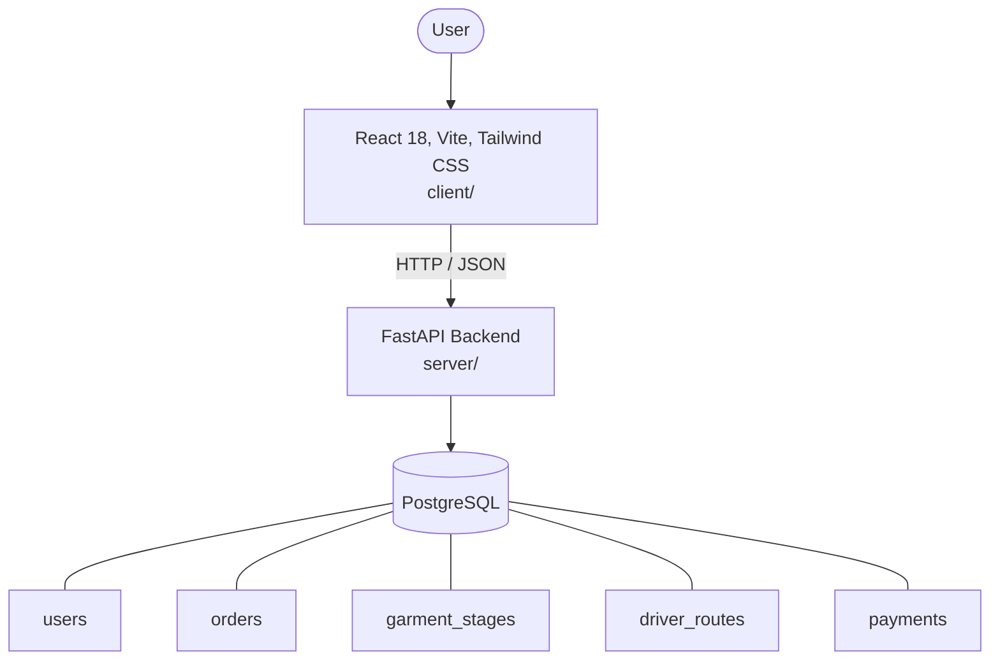

# Architecture

_Auto-generated by the SDLC Assistant from the generated codebase and the approved Feature Spec (latest: SCRUM-43). Regenerated on each push._

## System Diagram

## Tech Stack
- **language**: Python 3.11
- **backend_framework**: FastAPI
- **orm**: SQLAlchemy 2.x
- **database**: PostgreSQL
- **frontend**: React 18, Vite, Tailwind CSS
- **cloud_provider**: Google Cloud Platform (GCP Cloud Run)
- **constitution_section_4_followed**: True

## Backend Modules (server/)
- server/__init__.py
- server/api/__init__.py
- server/api/v1/__init__.py
- server/api/v1/endpoints/__init__.py
- server/api/v1/endpoints/auth.py
- server/api/v1/endpoints/orders.py
- server/api/v1/endpoints/payments.py
- server/api/v1/endpoints/pickups.py
- server/api/v1/endpoints/routes.py
- server/core/__init__.py
- server/core/config.py
- server/core/security.py
- server/crud.py
- server/database.py
- server/main.py
- server/models.py
- server/schemas.py
- server/tests/__init__.py
- server/tests/conftest.py
- server/tests/test_auth.py
- server/tests/test_orders.py
- server/tests/test_payments.py
- server/tests/test_routes.py

## Frontend Modules (client/)
- client/eslint.config.js
- client/postcss.config.js
- client/src/App.jsx
- client/src/App.test.jsx
- client/src/components/Header.jsx
- client/src/components/Modal.jsx
- client/src/components/Sidebar.jsx
- client/src/components/StatCard.jsx
- client/src/components/catalog/AddBookModal.jsx
- client/src/components/catalog/BookCatalogTable.jsx
- client/src/components/common/Badge.jsx
- client/src/components/common/Button.jsx
- client/src/components/common/Modal.jsx
- client/src/components/common/SearchBar.jsx
- client/src/components/dashboard/ActiveLoansTable.jsx
- client/src/components/dashboard/OverdueFinesTable.jsx
- client/src/components/dashboard/QuickActionsPanel.jsx
- client/src/components/dashboard/StatCard.jsx
- client/src/components/inventory/InventoryForm.jsx
- client/src/components/inventory/InventoryTable.jsx
- client/src/components/layout/Header.jsx
- client/src/components/layout/Sidebar.jsx
- client/src/components/member/BookCard.jsx
- client/src/components/member/MyFinesPanel.jsx
- client/src/components/member/MyLoansTable.jsx
- client/src/main.jsx
- client/src/pages/BookCatalogManagement.jsx
- client/src/pages/InventoryDashboardPage.jsx
- client/src/pages/InventoryDashboardPage.test.jsx
- client/src/pages/InventoryFormPage.jsx
- client/src/pages/InventoryFormPage.test.jsx
- client/src/pages/LibrarianDashboard.jsx
- client/src/pages/Login.jsx
- client/src/pages/MemberPortal.jsx
- client/src/pages/PasswordReset.jsx
- client/src/services/api.js
- client/src/setup.js
- client/tailwind.config.js
- client/vite.config.js

## API Endpoints
- POST /api/v1/auth/register
- POST /api/v1/auth/login
- POST /api/v1/orders
- GET /api/v1/orders/{order_id}
- PATCH /api/v1/orders/{order_id}/stage
- GET /api/v1/routes/driver/{driver_id}
- PATCH /api/v1/routes/stops/{stop_id}
- POST /api/v1/payments/checkout-session
- POST /api/v1/payments/stripe/webhook

## Data Model
- users
- orders
- garment_stages
- driver_routes
- payments
