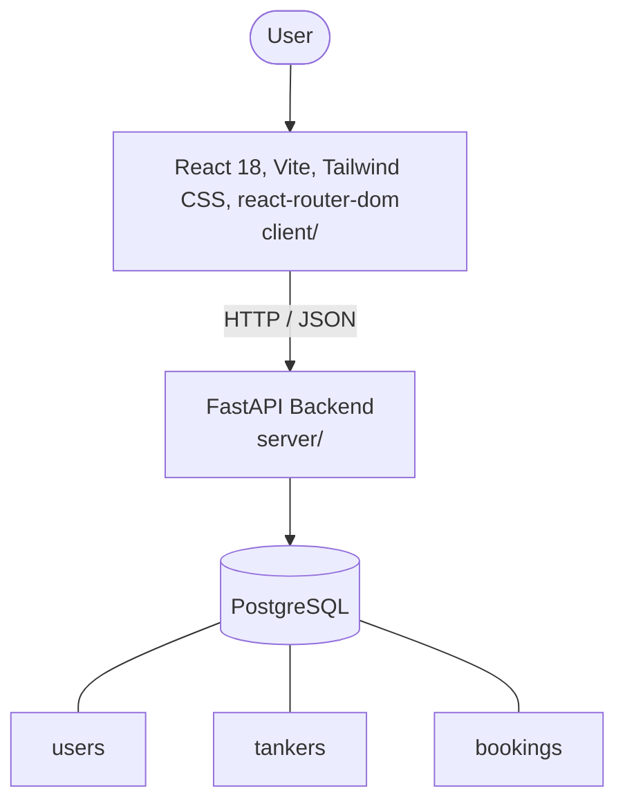

# Architecture

_Auto-generated by the SDLC Assistant from the generated codebase and the approved Feature Spec (latest: SCRUM-63). Regenerated on each push._

## System Diagram

## Tech Stack
- **language**: Python 3.11
- **backend_framework**: FastAPI
- **orm**: SQLAlchemy 2.x
- **database**: PostgreSQL
- **frontend**: React 18, Vite, Tailwind CSS, react-router-dom
- **cloud_provider**: Google Cloud Platform (GCP)
- **constitution_section_4_followed**: True

## Backend Modules (server/)
- server/__init__.py
- server/auth.py
- server/config.py
- server/database.py
- server/main.py
- server/models/__init__.py
- server/models/booking.py
- server/models/tanker.py
- server/models/user.py
- server/routers/__init__.py
- server/routers/admin.py
- server/routers/auth.py
- server/routers/bookings.py
- server/routers/deliveries.py
- server/routers/dispatch.py
- server/routers/tankers.py
- server/routers/users.py
- server/schemas/__init__.py
- server/schemas/admin.py
- server/schemas/booking.py
- server/schemas/tanker.py
- server/schemas/user.py
- server/tests/__init__.py
- server/tests/conftest.py
- server/tests/test_admin.py
- server/tests/test_auth.py
- server/tests/test_bookings.py
- server/tests/test_deliveries.py
- server/tests/test_dispatch.py
- server/tests/test_websocket.py
- server/websocket.py

## Frontend Modules (client/)
- (no client/ files found yet)

## API Endpoints
- POST /api/v1/auth/register
- POST /api/v1/auth/login
- POST /api/v1/bookings
- GET /api/v1/bookings
- POST /api/v1/dispatch/assign
- PATCH /api/v1/deliveries/{id}/status
- GET /api/v1/admin/analytics
- WS /api/v1/ws?token={jwt_token}

## Data Model
- users
- tankers
- bookings
