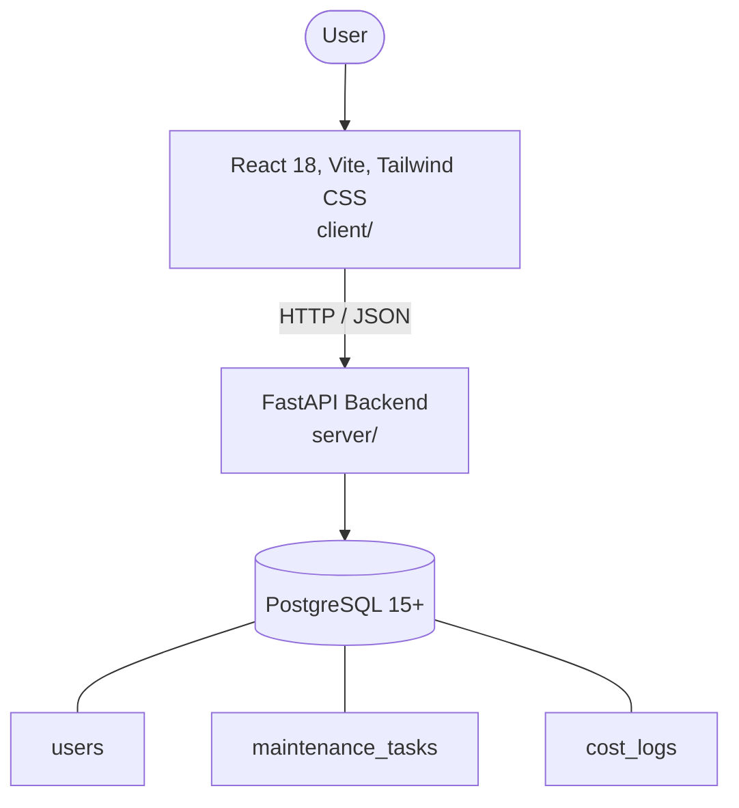

# Architecture

_Auto-generated by the SDLC Assistant from the generated codebase and the approved Feature Spec (latest: SCRUM-98). Regenerated on each push._

## System Diagram

## Tech Stack
- **language**: Python 3.11
- **backend_framework**: FastAPI
- **orm**: SQLAlchemy 2.x
- **database**: PostgreSQL 15+
- **frontend**: React 18, Vite, Tailwind CSS
- **cloud_provider**: Google Cloud Platform (GCP)
- **constitution_section_4_followed**: True

## Backend Modules (server/)
- server/__init__.py
- server/api/__init__.py
- server/api/v1/__init__.py
- server/api/v1/costs.py
- server/api/v1/router.py
- server/api/v1/tasks.py
- server/api/v1/technicians.py
- server/config.py
- server/database.py
- server/main.py
- server/models/__init__.py
- server/models/cost_log.py
- server/models/task.py
- server/models/user.py
- server/schemas/__init__.py
- server/schemas/cost_log.py
- server/schemas/task.py
- server/schemas/user.py
- server/services/__init__.py
- server/services/cost_service.py
- server/services/task_service.py
- server/services/user_service.py
- server/tests/__init__.py
- server/tests/conftest.py
- server/tests/test_costs.py
- server/tests/test_tasks.py
- server/tests/test_technicians.py

## Frontend Modules (client/)
- (no client/ files found yet)

## API Endpoints
- POST /api/v1/tasks
- GET /api/v1/tasks
- GET /api/v1/tasks/{id}
- PUT /api/v1/tasks/{id}
- PUT /api/v1/tasks/{id}/assign
- PUT /api/v1/tasks/{id}/complete
- DELETE /api/v1/tasks/{id}
- GET /api/v1/technicians
- GET /api/v1/costs/summary

## Data Model
- users
- maintenance_tasks
- cost_logs
