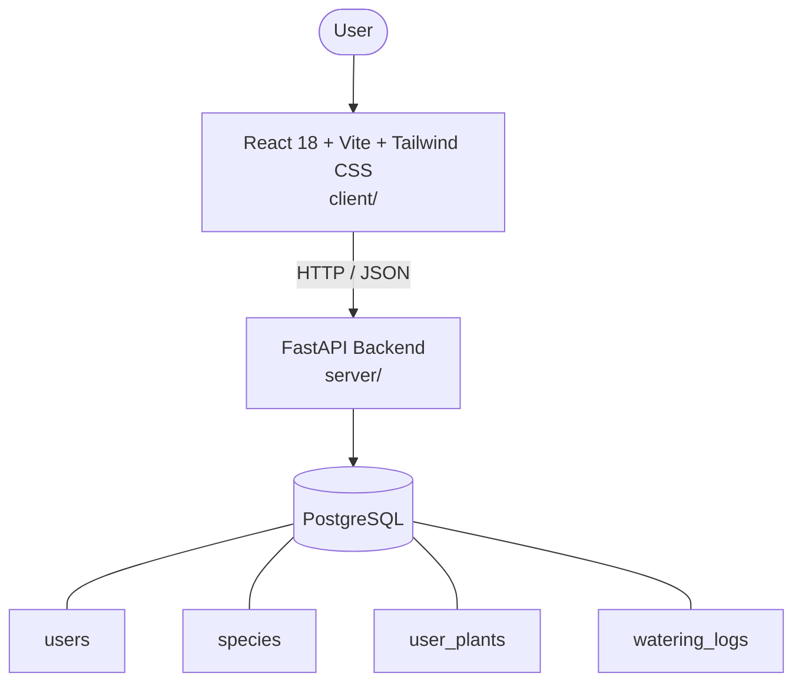

# Architecture

_Auto-generated by the SDLC Assistant from the generated codebase and the approved Feature Spec (latest: SCRUM-242). Regenerated on each push._

## System Diagram

## Tech Stack
- **language**: Python 3.11
- **backend_framework**: FastAPI
- **orm**: SQLAlchemy 2.x
- **database**: PostgreSQL
- **frontend**: React 18 + Vite + Tailwind CSS
- **cloud_provider**: GCP (Cloud Run & Cloud SQL)
- **constitution_section_4_followed**: True

## Backend Modules (server/)
- server/__init__.py
- server/database.py
- server/main.py
- server/middleware/__init__.py
- server/middleware/auth.py
- server/models.py
- server/routers/__init__.py
- server/routers/auth.py
- server/routers/plants.py
- server/routers/schedules.py
- server/routers/species.py
- server/schemas.py
- server/tests/__init__.py
- server/tests/conftest.py
- server/tests/test_auth.py
- server/tests/test_plants.py
- server/tests/test_schedules.py
- server/tests/test_species.py

## Frontend Modules (client/)
- (no client/ files found yet)

## API Endpoints
- GET /api/v1/species
- GET /api/v1/species/{species_id}
- POST /api/v1/species
- GET /api/v1/plants
- POST /api/v1/plants
- GET /api/v1/plants/{plant_id}
- PUT /api/v1/plants/{plant_id}
- DELETE /api/v1/plants/{plant_id}
- POST /api/v1/plants/{plant_id}/water
- GET /api/v1/schedules/dashboard

## Data Model
- users
- species
- user_plants
- watering_logs
